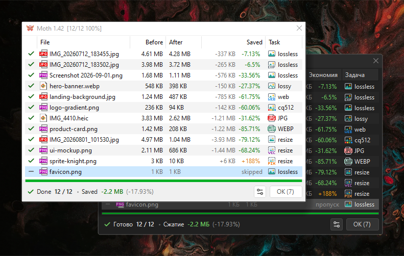
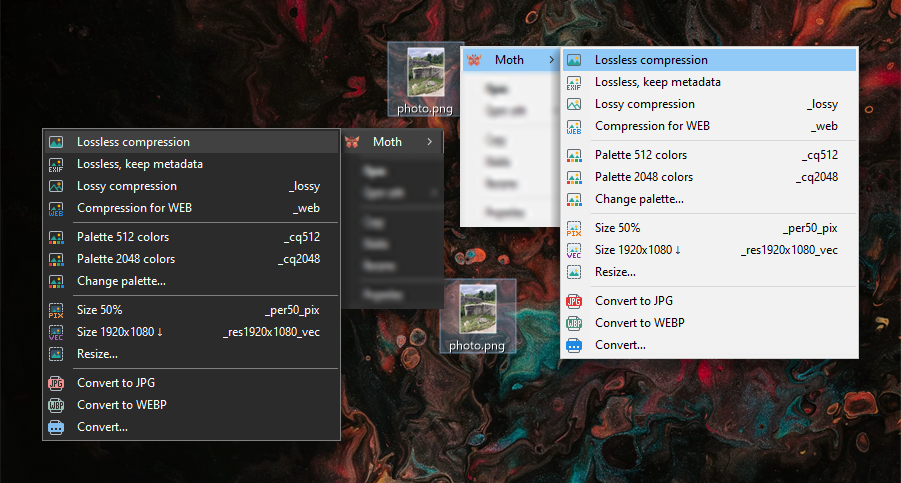
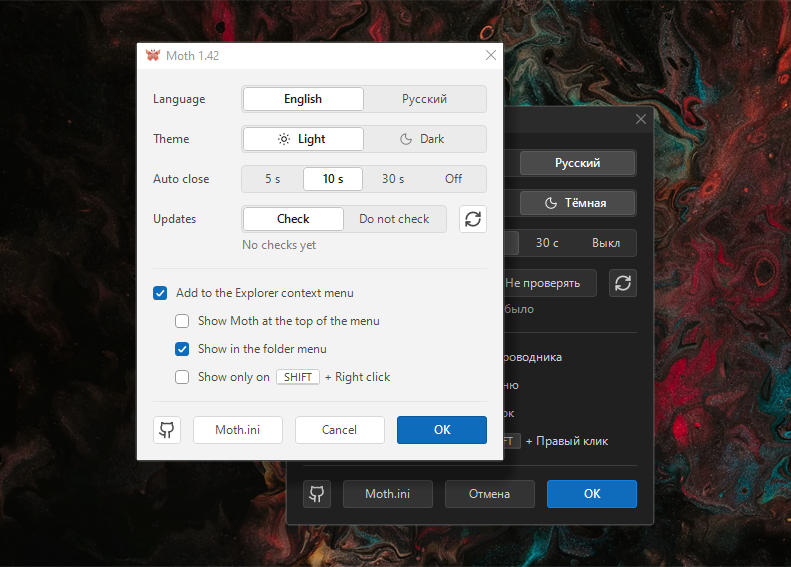
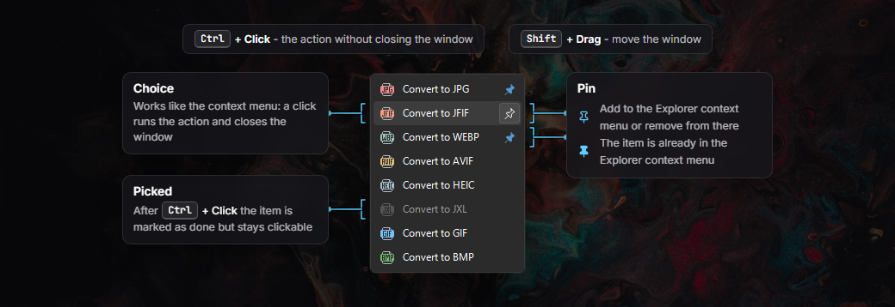
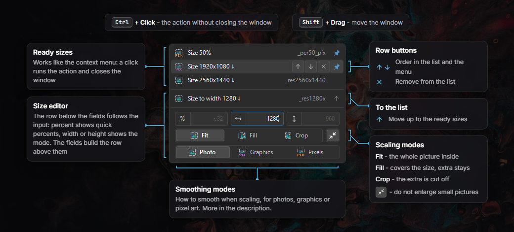

[Русский](README.md) | [English](README.EN.md)

#  Moth - lossless image compression. A new release is in progress.

 

Batch image optimization and conversion in two clicks from the Explorer context menu. Moth works through the queue and shows the result for every file:

The actions for each format are grouped in the Moth submenu:

## Features
* Works with files and folders from the context menu
* Lossless and lossy compression, WEB optimization, palette, conversion, resizing
* The progress window closes by itself after a delay set in the settings, a click on the window cancels closing
* Drag-and-drop support
* The file list updates on the fly, you can add to the queue while Moth is working
* Flexible overwrite rules: by default only lossless compression overwrites the file
* Light and dark theme, English and Russian, update check
* Compression formats: `AVIF` `BMP` `GIF` `JFIF` `JPE` `JPEG` `JPG` `JXL` `PNG` `WEBP`
* Conversion formats: `AVIF` `BMP` `GIF` `HEIC` `HEIF` `JFIF` `JPE` `JPEG` `JPG` `JXL` `PNG` `WEBP`

## Installation
1. Unpack the archive to any folder, for example `C:\Program Files\Moth`
2. Run `Settings.exe`, tick "Add to the Explorer context menu" and press OK
3. The `Moth` item appears in the Explorer context menu

To remove Moth from the menu, untick the same box. If you move the Moth folder, open the settings and press OK again.

## Formats and actions

| Action | JPEG | JFIF | PNG | WEBP | JXL | AVIF | GIF | BMP |
|---|:-:|:-:|:-:|:-:|:-:|:-:|:-:|:-:|
| **Lossless compression** Compression algorithms are tried to reduce the size. Exif and metadata are removed too. |  |  |  |  |  |  |  |  |
| **Lossless, keep Exif / metadata** The same, but Exif and metadata are kept. |  |  |  |  |  |  |  |  |
| **Lossy compression** Careful compression with no visible changes. |  |  |  |  |  |  |  |  |
| **Compression for WEB** Stronger compression, but gentle to gradients. |  |  |  |  |  |  |  |  |
| **Palette change** Fewer colors to reduce the size. Hilbert curve dithering. |  |  |  |  |  |  |  |  |

### Conversion

| Format | Files | What you get |
|---|---|---|
| **JPEG** | `.jpg` `.jpeg` `.jpe` | Saved as `.jpg`, transparency is filled with white |
| **JFIF** | `.jfif` | The same JPEG with a JFIF header. From JPEG it is made without re-encoding |
| **PNG** | `.png` | Lossless |
| **WEBP** | `.webp` | Lossless from JPEG, PNG, GIF and BMP, GIF animation is kept |
| **JXL** | `.jxl` | JPEG is converted reversibly, lossless images stay lossless |
| **AVIF** | `.avif` | Quality 85: visually lossless, smaller than the source JPEG |
| **HEIC** | `.heic` `.heif` | Saved as `.heic`, quality 70, 4:2:0 color like iPhone photos |
| **GIF** | `.gif` | 256 colors with dithering, WEBP animation is kept |
| **BMP** | `.bmp` | Uncompressed, transparency is filled with white |

All formats convert to each other, in any direction.

Extensions in one row are the same format, so there is nothing to convert between them. For example, Moth skips `.jpe` to JPG or `.heif` to HEIC.

The menu shows conversion to JPG and PNG right away, the other formats are in the "Convert…" window, see below. Each format gets only the items it supports there.

For GIF and WEBP animation the first frame is converted, except GIF to WEBP and JXL and WEBP to GIF: there the animation is kept.

Colors do not change. If an image has a color profile other than sRGB, such as Display P3 from a phone or Adobe RGB, Moth keeps it when compressing and converting. An sRGB profile is removed: the image looks the same without it. GIF and BMP cannot store a profile, so converting to them turns the colors into sRGB.

JPEG to JXL is lossless and reversible: the file gets about 15–20% smaller, and converting such a JXL back to JPG restores the original JPEG byte for byte.

Empty cells are not an oversight:
* AVIF and HEIC are not compressed losslessly, and removing the color profile is not desirable.
* BMP stores the image uncompressed, lossy BMP makes no sense, converting is better.
* The palette is offered where its result stays lossless: PNG, WEBP and JXL. JPEG and AVIF lose the palette when compressing, and GIF has at most 256 colors anyway

## Choice windows
### Extended list
Items with an ellipsis open a window with a list. The list holds only the actions the file format supports.

### Resize
The resize window has ready sizes on top, below them the row of your own size and the panel that builds it.

* The title and postfix of the row change as you edit the fields. Next time the row holds the last applied size
* The size comes from the percent or from width and height, whichever fields have the focus. Moving to the other fields switches at once, empty fields get the gray hint. Typing clears the fields of the other kind
* A size that does not enlarge has a `↓` in its title

The bottom row is the smoothing mode: how to smooth when scaling. Pick it by what the picture holds:

| Button | Filter | Best for | Postfix |
|---|---|---|---|
| **Photo** | Lanczos | The default, a universal filter for most cases. | - |
| **Graphics** | Catmull-Rom | Screenshots, diagrams, text, logos. Almost as sharp, but with less halo around letters and lines, flat fills stay even. | `_vec` |
| **Pixels** | Point | Good for pixel art and small icons. Neighbor pixels are not blended, edges stay stepped. Best when enlarging by a whole number: 200% or 300%. | `_pix` |

The result is saved next to the original, with a postfix by size, mode and smoothing: `_per50`, `_res1920x1080`, `_res800x800_crop_vec`.

## Moth uses
Everything is already in the archive, in the `Apps` folder:

* [`pingo 1.27.3`](https://css-ig.net/pingo) – PNG: lossless, lossy and WEB compression
* [`jpegoptim 1.5.6`](https://github.com/tjko/jpegoptim) – JPEG and JFIF: lossless, lossy and WEB compression
* [`ECT 0.9.5`](https://github.com/fhanau/Efficient-Compression-Tool) – JPEG: a second lossless attempt, the smaller file wins
* [`jpegtran 10`](http://jpegclub.org/jpegtran/) – JPEG: lossless rotation by the Exif tag
* [`cwebp 1.6.0`](https://developers.google.com/speed/webp/docs/cwebp) – WEBP: compression and conversion to WEBP
* [`libjxl 0.12.0`](https://github.com/libjxl/libjxl) – JXL: compression, conversion to JXL and back, JPEG is restored byte for byte
* [`gifsicle 1.95`](https://www.lcdf.org/gifsicle/) – GIF: lossless, lossy and WEB compression
* [`ImageWorsener 1.3.5`](https://entropymine.com/imageworsener/) – BMP: lossless compression
* [`libheif 1.23.4`](https://github.com/strukturag/libheif) – conversion to HEIC, x265 encoder
* [`ImageMagick 7.1.2-31`](https://imagemagick.org) – conversion, palette, resizing, AVIF and reading HEIC

After conversion and palette reduction the result is squeezed by the same tool as in lossless compression.

## ⚠️ Antivirus
Moth is written in AutoIt, and some antivirus software may flag the exe files as suspicious. 
This is a known false positive for programs compiled from AutoIt.

## 🤝 Support
Bug reports and suggestions are welcome.
Support: [CloudTips](https://pay.cloudtips.ru/p/c4a97b44).
