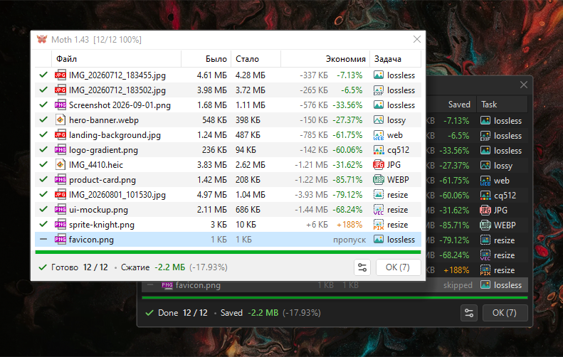
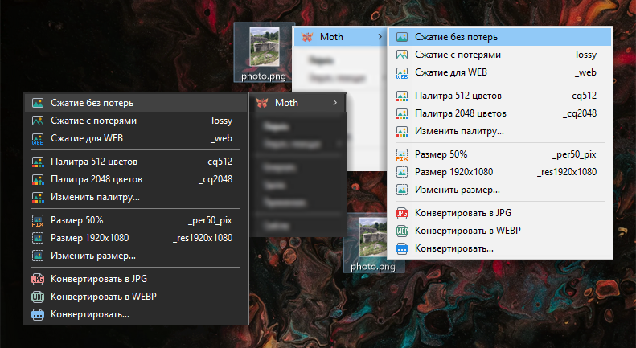
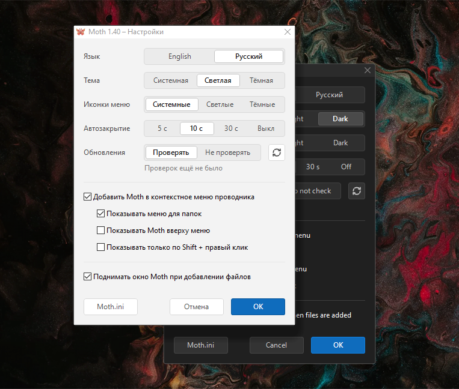
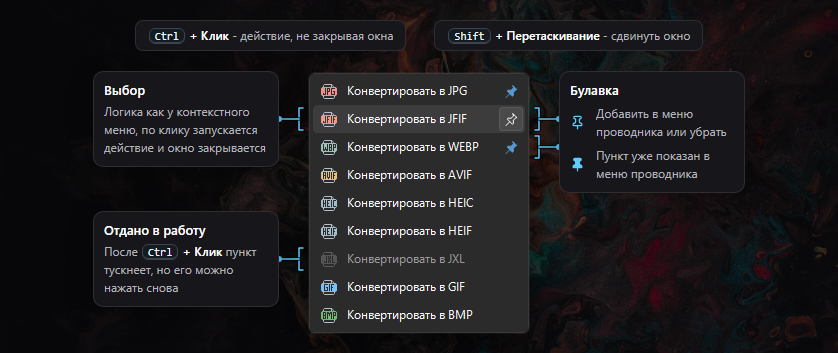
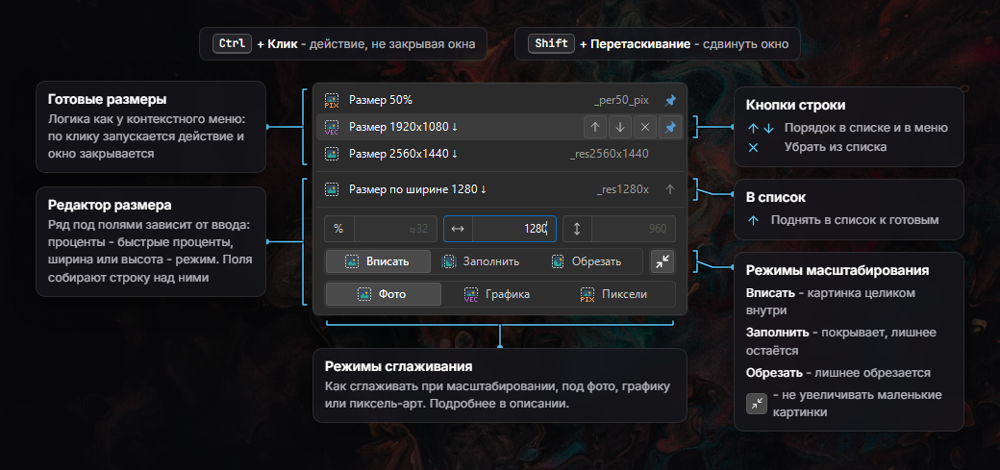

[Русский](README.md) | [English](README.EN.md)

#  Moth - сжатие и конвертация изображений

 

Утилита для пакетной оптимизации и конвертации изображений за два клика из контекстного меню проводника. Moth обрабатывает очередь и показывает итог по каждому файлу.

Выбор действий для каждого формата может отличаться из-за его особенностей.

## Возможности
* Работа с файлами и папками из контекстного меню
* Сжатие изображений без потерь и с потерями, палитра, конвертация, изменение размера
* Окно прогресса закрывается автоматически, клик по окну отменяет закрытие
* Список файлов обновляется динамически, очередь можно дополнять пока идёт работа
* Светлая и тёмная тема, русский и английский язык, проверка обновлений
* Настройка перезаписи, по умолчанию файл перезаписывается только при сжатии без потерь
* Поддержка перетаскивания drag-and-drop
* Цветовой профиль всегда сохраняется, кроме sRGB, без него картинка не меняется
* Метка ориентации учитывается для всех действий, снимок не ляжет на бок
* Форматы для сжатия: `AVIF` `BMP` `GIF` `JFIF` `JPE` `JPEG` `JPG` `JXL` `PNG` `WEBP`
* Форматы для конвертации: `AVIF` `BMP` `GIF` `HEIC` `HEIF` `JFIF` `JPE` `JPEG` `JPG` `JXL` `PNG` `WEBP`

## Форматы и действия

| Действие | &nbsp;JPEG&nbsp; | &nbsp;&nbsp;JFIF&nbsp;&nbsp; | &nbsp;PNG&nbsp;&#8239; | WEBP&#8239; | &nbsp;&nbsp;JXL&nbsp;&nbsp;&#8239; | &nbsp;AVIF&nbsp;&#8239; | &nbsp;&nbsp;GIF&nbsp;&nbsp;&#8239; | &nbsp;BMP&nbsp;&#8239; |
|---|:-:|:-:|:-:|:-:|:-:|:-:|:-:|:-:|
| **Сжатие без потерь** Перебираются алгоритмы сжатия для уменьшения размера. Также удаляются Exif и метаданные. |  |  |  |  |  |  |  |  |
| **Без потерь, сохранить Exif / Meta** То же самое, но Exif и метаданные сохраняются. |  |  |  |  |  |  |  |  |
| **Сжатие с потерями** Аккуратное сжатие без видимых изменений. |  |  |  |  |  |  |  |  |
| **Сжатие для WEB** Сжатие агрессивнее, но щадит градиенты. |  |  |  |  |  |  |  |  |
| **Изменение палитры** Уменьшение числа цветов для уменьшения размера. Дизеринг по кривой Гильберта. |  |  |  |  |  |  |  |  |
| **Изменение размера** Проценты, ширина и высота, свои пресеты. Режимы масштабирования и фильтры сжатия. |  |  |  |  |  |  |  |  |

#### Пустые клетки - это нормально:

* AVIF без потерь не сжимается, а удалять из него цветовой профиль нежелательно. 
 Изменение палитры для AVIF не имеет смысла, файл получается больше исходного.
* BMP хранит картинку без сжатия, сжимать его с потерями бессмысленно, лучше конвертировать.
* JPEG и AVIF изменение палитры не уменьшит, а сжатие снова размоет цвета на тысячи оттенков.
* GIF ограничен 256 цветами, для него изменение палитры есть только 64 и 128.

## Конвертация

Все форматы конвертируются друг в друга, в любую сторону. 
Конвертация в JPG, PNG и WEBP стоит в меню по умолчанию.

| Формат | Файлы | Подробности |
|---|---|---|
| **JPEG** | `.jpg` `.jpeg` `.jpe` | Всегда сохраняется как `.jpg`, прозрачность заливается белым |
| **JFIF** | `.jfif` | Тот же JPEG с заголовком JFIF. Из JPEG получается без перекодирования |
| **PNG** | `.png` | Конвертируется без потерь |
| **WEBP** | `.webp` | Из JPEG, PNG, GIF и BMP без потерь, анимация GIF сохраняется |
| **JXL** | `.jxl` | JPEG переводится обратимо, картинки без потерь остаются без потерь |
| **AVIF** | `.avif` | Качество 85, на глаз без потерь, файл меньше исходного JPEG |
| **HEIC** | `.heic` | Качество 70, цвет 4:2:0, как у снимков iPhone |
| **HEIF** | `.heif` | Тот же HEIC под другим расширением |
| **GIF** | `.gif` | 256 цветов с дизерингом, анимация WEBP сохраняется |
| **BMP** | `.bmp` | Без сжатия, прозрачность заливается белым |

#### Особенности

* HEIC и HEIF с кодеком HEVC переводятся друг в друга без потерь, меняется только расширение.
* HEIF с другим кодеком, например AV1, в HEIC кодируется заново.
* Конвертация GIF и WEBP в неанимированный формат сохраняет только первый кадр.

## Подробнее про JPEG

Ориентация из Exif учитывается для всех действий, снимок не ляжет на бок
* Сжатие с Exif оставляет метку, картинку поворачивает просмотрщик
* Сжатие без Exif поворачивает JPEG без потерь и перекодирования
* Если без потерь не повернуть, метка остаётся в файле
* Конвертация и изменение размера сохраняют картинку повёрнутой

Прогрессивный JPEG выбирается автоматически
* Сжатие для WEB всегда сохраняет прогрессивный JPEG
* Остальное сжатие и конвертация в JPEG выбирают меньший из двух вариантов

## Использование
1. Распакуйте архив в удобную папку, например `D:\Portable\Moth`
2. Запустите `Settings.exe`, отметьте «Добавить в контекстное меню проводника» и нажмите «ОК» 
  В контекстном меню появится пункт `Moth`

Чтобы убрать Moth из меню, снимите ту же галочку. Если папку с Moth перенести, откройте настройки и снова нажмите «ОК».

## Окна меню
### Расширенный список
Пункт с многоточием открывает список действий, доступных формату файла.

Булавка справа от действия закрепляет его в меню проводника, у каждого формата свои закреплённые пункты. `Ctrl` + **Клик** - запускает действие, не закрывая окна. `Shift` + **Перетаскивание** - двигает окно.

### Изменение размера
В окне сверху готовые пресеты, ниже строка своего размера и панель, которая её собирает.

Подпись и постфикс строки меняются на лету. Последнее применённое действие сохраняется. 
Размер без увеличения помечен в подписи стрелкой `↓`.

Если заданы ширина и высота, режим решает, как картинка ляжет в рамку:
* **Вписать** - картинка целиком внутри размера, пропорции сохраняются
* **Заполнить** - картинка покрывает размер, лишнее остаётся, постфикс `_fill`
* **Обрезать** - картинка покрывает размер, лишнее обрезается, постфикс `_crop`

Нижний ряд - это режим сглаживания, его выбирают по тому что на картинке:

| Кнопка | Фильтр | Для чего | Постфикс |
|---|---|---|---|
| **Фото** | Lanczos | Это база, универсальный фильтр для большинства случаев. | - |
| **Графика** | Catmull-Rom | Скриншоты, схемы, текст, логотипы. Почти так же резко, но ореолов вокруг букв и линий меньше, заливки остаются ровными. | `_vec` |
| **Пиксели** | Point | Хорошо подходит для пиксель-арта и мелких иконок. Цвета соседних пикселей не смешиваются, края остаются ступеньками. Лучше использовать при увеличении в целое число раз: 200% или 300%. | `_pix` |

Итоговый файл сохраняется рядом, с постфиксом по размеру, режиму и сглаживанию: `_per50`, `_res1920x1080`, `_res800x800_crop_vec`.

## Moth использует
Всё уже в архиве, в папке `Apps`:

* [`pingo 1.27.3`](https://css-ig.net/pingo) – PNG: сжатие без потерь, с потерями и для WEB
* [`jpegoptim 1.5.6`](https://github.com/tjko/jpegoptim) – JPEG и JFIF: сжатие без потерь, с потерями и для WEB
* [`ECT 0.9.5`](https://github.com/fhanau/Efficient-Compression-Tool) – JPEG: второй вариант сжатия без потерь, остаётся меньший файл
* [`jpegtran 10`](http://jpegclub.org/jpegtran/) – JPEG: поворот по Exif-тегу без потерь
* [`cwebp 1.6.0`](https://developers.google.com/speed/webp/docs/cwebp) – WEBP: сжатие и конвертация в WEBP
* [`libjxl 0.12.0`](https://github.com/libjxl/libjxl) – JXL: сжатие, конвертация в JXL и обратно, JPEG восстанавливается байт в байт
* [`gifsicle 1.95`](https://www.lcdf.org/gifsicle/) – GIF: сжатие без потерь, с потерями и для WEB, дожимает палитру
* [`ImageWorsener 1.3.5`](https://entropymine.com/imageworsener/) – BMP: сжатие без потерь
* [`libheif 1.23.4`](https://github.com/strukturag/libheif) – конвертация в HEIC и HEIF, кодировщик x265
* [`ImageMagick 7.1.2-31`](https://imagemagick.org) – конвертация, палитра, изменение размера, AVIF и чтение HEIC и HEIF

После конвертации и палитры итог дожимается той же утилитой, что и при сжатии без потерь.

## Антивирусы
Moth написан на AutoIt, некоторые антивирусы могут помечать exe файлы как подозрительные. 
Это [известная проблема](https://www.autoitscript.com/wiki/AutoIt_and_Malware) ложных срабатываний на программы, скомпилированные из AutoIt.

## 🤝 Поддержка
Баг‑репорты и предложения приветствуются.
Поддержка: [CloudTips](https://pay.cloudtips.ru/p/c4a97b44).
